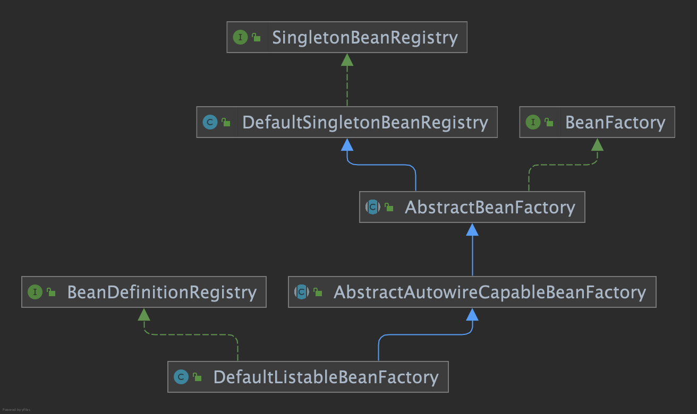
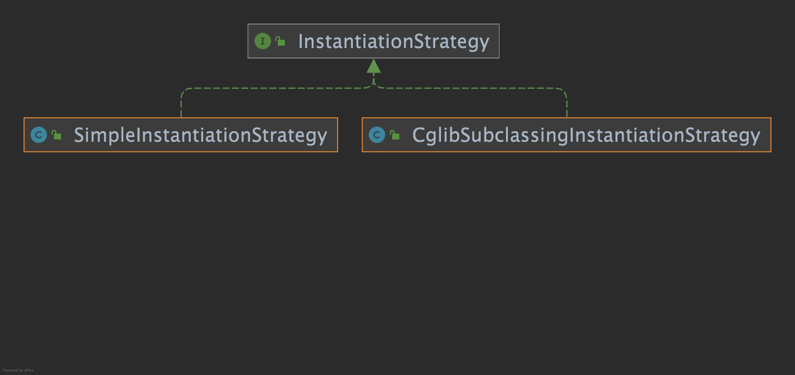

### 01-simple-bean-container
定义一个最简单的容器BeanFactory，内部用一个map来保存bean，只有注册bean和获取bean两个方法。

### 02-bean-definition-and-registry
bean的定义和注册，主要增加如下类：
- BeanDefinition：定义bean信息的类，包含bean的Class类型、属性值等信息
- BeanDefinitionRegistry：注册bean定义的接口
- SingletonBeanRegistry：注册单例bean的接口
- DefaultSingletonBeanRegistry：注册单例bean的默认实现类
- AbstractBeanFactory：提供获取bean的能力
- AbstractAutowireCapableBeanFactory：提供根据bean定义创建bean的能力
- DefaultListableBeanFactory：继承AbstractAutowireCapableBeanFactory、实现BeanDefinitionRegistry，具备注册bean定义、根据bean定义创建bean、获取bean的能力

### 03-instantiation-strategy
beanClass.newInstance只能用来实例化有无参构造函数的bean，为了让bean的实例化更具扩展性，定义一个实例化接口InstantiationStrategy，bean的实例化交由InstantiationStrategy的子类来实现。
- InstantiationStrategy：根据bean定义来实例化bean的接口
- SimpleInstantiationStrategy：默认实现，根据bean的无参构造函数实例化bean
- CglibSubclassingInstantiationStrategy：使用CGLIB动态生成子类来实例化bean

todo：
- 补充CGLIB细节

### 04-populate-bean-with-property-values
bean实例化后需要设置属性，定义PropertyValues来对应bean的属性。
- PropertyValue：对应bean的属性名和属性值
- PropertyValues：用来统一管理一个bean的所有属性
- BeanDefinition：新增PropertyValues字段
- AbstractAutowireCapableBeanFactory：新增applyPropertyValues方法，更新doCreateBean，创建bean后，调用applyPropertyValues设置属性

### 05-populate-bean-with-bean
增加BeanReference类，包装一个bean对另一个bean的引用。
实例化beanA后填充属性时，若Property#value为BeanReference，引用beanB，先实例化beanB。暂不支持循环依赖。
- BeanReference：只有一个字段beanName