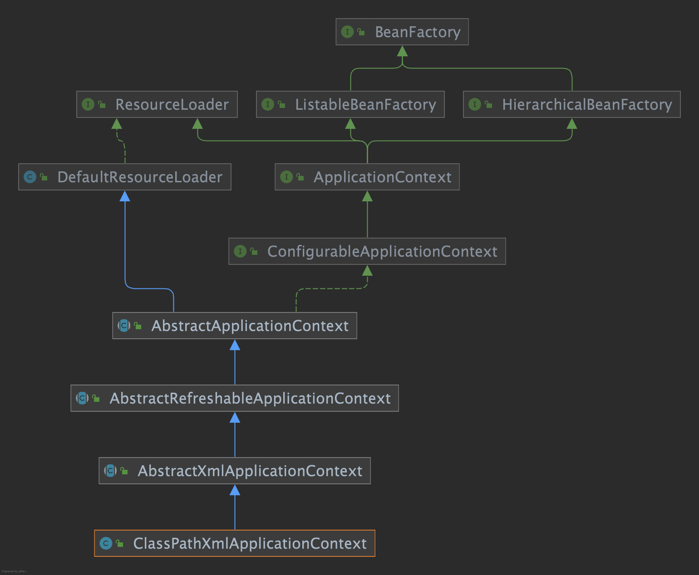

### 01-simple-bean-container
定义一个最简单的容器BeanFactory，内部用一个map来保存bean，只有注册bean和获取bean两个方法。

### 02-bean-definition-and-registry
bean的定义和注册，主要增加如下类：
- BeanDefinition：定义bean信息的类，包含bean的Class类型、属性值等信息
- BeanDefinitionRegistry：注册bean定义的接口
- SingletonBeanRegistry：注册单例bean的接口
- DefaultSingletonBeanRegistry：注册单例bean的默认实现类
- AbstractBeanFactory：提供获取bean的能力
- AbstractAutowireCapableBeanFactory：提供根据bean定义创建bean的能力
- DefaultListableBeanFactory：继承AbstractAutowireCapableBeanFactory、实现BeanDefinitionRegistry，具备注册bean定义、根据bean定义创建bean、获取bean的能力

### 03-instantiation-strategy
beanClass.newInstance只能用来实例化有无参构造函数的bean，为了让bean的实例化更具扩展性，定义一个实例化接口InstantiationStrategy，bean的实例化交由InstantiationStrategy的子类来实现。
- InstantiationStrategy：根据bean定义来实例化bean的接口
- SimpleInstantiationStrategy：默认实现，根据bean的无参构造函数实例化bean
- CglibSubclassingInstantiationStrategy：使用CGLIB动态生成子类来实例化bean

todo：
- 补充CGLIB细节

### 04-populate-bean-with-property-values
bean实例化后需要设置属性，定义PropertyValues来对应bean的属性。
- PropertyValue：对应bean的属性名和属性值
- PropertyValues：用来统一管理一个bean的所有属性
- BeanDefinition：新增PropertyValues字段
- AbstractAutowireCapableBeanFactory：新增applyPropertyValues方法，更新doCreateBean，创建bean后，调用applyPropertyValues设置属性

### 05-populate-bean-with-bean
增加BeanReference类，包装一个bean对另一个bean的引用。
实例化beanA后填充属性时，若Property#value为BeanReference，引用beanB，先实例化beanB。暂不支持循环依赖。
- BeanReference：只有一个字段beanName

### 06-resource-and-resource-loader
定义资源和资源加载器：
- Resource：资源类，只有一个方法，getInputStream
- ClasspathResource：classpath下的资源
- FileSystemResource：文件系统下的资源
- UrlResource：网络资源
- ResourceLoader：资源加载器，根据给定位置获取资源
- DefaultResourceLoader：默认资源加载器，先从classpath加载，再当作网络资源加载，最后从文件系统中加载

### 07-define-bean-in-xml
有了资源加载器，就可以在xml文件中定义bean的信息，利用资源加载器加载并解析bean的定义，然后往容器中注入BeanDefinition
BeanDefinitionReader需要有获取资源和注册BeanDefinition的能力，因此BeanDefinitionReader的抽象实现类AbstractBeanDefinitionReader有ResourceLoader和BeanDefinitionRegistry两个属性。

### 08-post-processor
BeanFactoryPostProcessor和BeanPostProcessor是Spring框架中具有重量级地位的两个接口，这两个接口都是Spring提供的容器扩展机制。

BeanFactoryPostProcessor允许在实例化bean之前修改BeanDefinition。

BeanPostProcessor定义了两个方法，分别在bean的初始化方法之前和之后执行。

代码更新：
- 在ConfigurableBeanFactory中添加addBeanPostProcessor方法
- AbstractBeanFactory原本实现BeanFactory，现在改为实现ConfigurableBeanFactory，并重写addBeanPostProcessor方法
- 在AutowireCapableBeanFactory中定义两个方法applyBeanPostProcessorsBeforeInitialization和applyBeanPostProcessorsAfterInitialization
- 在AbstractAutowireCapableBeanFactory中实现applyBeanPostProcessorsBeforeInitialization和applyBeanPostProcessorsAfterInitialization，定义initializeBean方法，并在doCreateBean方法中调用

### 09-application-context
ApplicationContext除了拥有BeanFactory的所有功能外，还支持特殊类型bean（如BeanFactoryPostProcessor、BeanPostProcessor）的自动识别、资源加载、容器事件和监听器、国际化支持、单列bean自动初始化等。

AbstractApplicationContext#refresh提供了一个轮廓。

### 10-bean-init-and-destroy
在Spring中，有三种方式定义bean的初始化方法和销毁方法：
- 在xml文件中指定init-method和destroy-method
- 继承InitializingBean和DisposableBean
- 在方法上加注解@PostConstruct和@PreDestroy

### 11-aware 
